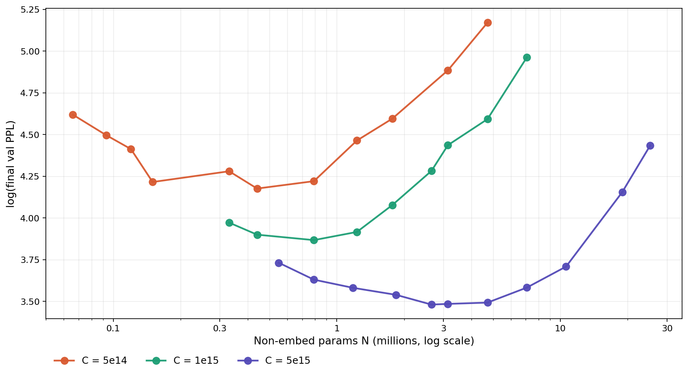
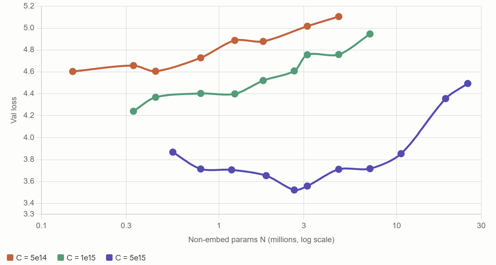
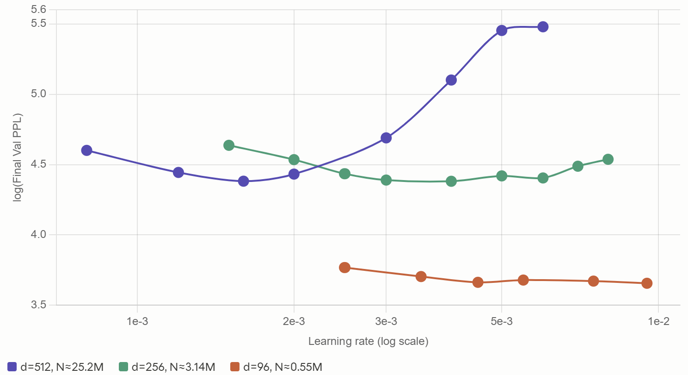

# llm-pipeline

A minimal from-scratch decoder-only transformer pipeline: BPE tokenizer → dataset → training → generation, followed by a small-scale replication of the Chinchilla scaling law.



## Overview

This project trains tiny transformers (0.07M–25M non-embedding parameters) on FineWeb-EDU and uses them to characterize the compute-optimal parameter/data tradeoff at small scale. The main finding:

- At compute budgets of C = 5e14 to 5e15 FLOPs, optimal tokens-per-parameter ratios sit around **100–400**, far above Hoffmann et al.'s D/N ≈ 20 at their scale — but consistent with recent replications (Besiroglu et al. 2024) and modern large-model practice (Llama 3, DeepSeek).
- Optimal D/N **decreases** as compute grows, trending toward the classical Chinchilla regime at large C.
- Getting a clean scaling curve at this scale requires **per-width learning rate calibration** — a fixed LR across model widths produces a biased U-curve with the minimum shifted toward small models.

## Recent Fixes

- Replaced naive pair search with `heapq` in `tokenizer.py` for faster BPE training.
- Switched `dataset.py` from stride-1 sliding window to non-overlapping chunks for efficient teacher forcing.

## Project Structure

| File | Description |
|---|---|
| `main_gpu.py` | Training + evaluation + generation pipeline |
| `transformer.py` | Decoder-only transformer model |
| `tokenizer.py` | BPE tokenizer (train / encode / decode) |
| `dataset.py` | `LMDataset` for causal LM windowed samples |
| `experiment.py` | Experiment scripts |
| `run_chinchilla.sh` | Chinchilla sweep runner (GPU) |

Training logs, model checkpoints, and run configs are saved to `output/<timestamp>/`.

# Environment Setup

## Local (CPU or single GPU)

Recommended — install from the lockfile:

```bash
uv sync
```

This reads `pyproject.toml` + `uv.lock` and recreates the exact environment.

Manual setup (how the environment was originally built):

```bash
uv init
uv add torch torchvision --index https://download.pytorch.org/whl/cu126 --index-strategy unsafe-best-match
uv add regex "datasets>=3.0" --index-strategy unsafe-best-match
```

## Remote GPU Server

Use a PyTorch base template (e.g. [PyTorch on Vast.ai](https://hub.docker.com/r/vastai/pytorch/)). `run_chinchilla.sh` handles dependency installation at the top of the script, so no separate setup is needed — just run it.

## Running

Single experiment:

```bash
uv run main_gpu.py
```

All local sweep experiments:

```bash
chmod +x run_local.sh
./run_local.sh
```

GPU sweep (with auto-install):

```bash
chmod +x run_chinchilla.sh
./run_chinchilla.sh
```

# Experiment 1 — Initial Scaling Sweep (Biased)

**Goal:** replicate the Chinchilla isoFLOP methodology at three compute budgets and extract the U-curve of compute-optimal model size.

**Setup:** all runs use a fixed learning rate of `1.2e-3`, batch size 32, context length 1024, cosine schedule. The LR value was chosen by calibration on a single reference model (`d_model=512`). Non-embedding parameter counts are used for N.

**Result:** U-curves appear, but are heavily biased toward small models. At C = 1e15 and C = 5e14, the minimum is never reached within the sweep — losses keep decreasing as N shrinks. The initial interpretation ("the model absorbs unbounded data") turned out to be an artifact of under-tuned LR at small widths (see Experiment 2).



<details>
<summary>C ≈ 5e14 FLOPs (click to expand)</summary>

| d_model | n_layers | n_heads | d_ff | Tokens (M) | N (M) | D/N | **Loss** | **Val PPL** |
|---|---|---|---|---|---|---|---|---|
| 256 | 6 | 8 | 1024 | 18   | 4.72 | 3.8   | **5.106** | **169.08** |
| 256 | 4 | 8 | 1024 | 27   | 3.14 | 8.5   | **5.018** | **151.00** |
| 192 | 4 | 6 | 768  | 47   | 1.77 | 27    | **4.879** | **135.80** |
| 160 | 4 | 4 | 640  | 68   | 1.23 | 55    | **4.888** | **127.96** |
| 128 | 4 | 4 | 512  | 106  | 0.79 | 135   | **4.729** | **114.98** |
| 96  | 4 | 3 | 384  | 189  | 0.44 | 429   | **4.606** | **105.28** |
| 96  | 3 | 3 | 384  | 252  | 0.33 | 762   | **4.658** | **105.12** |
| 64  | 4 | 4 | 256  | 544  | 0.15 | 3627  | **4.604** |  **99.21** |

</details>

<details>
<summary>C ≈ 1e15 FLOPs</summary>

| d_model | n_layers | n_heads | d_ff | Tokens (M) | N (M) | D/N | **Loss** | **Val PPL** |
|---|---|---|---|---|---|---|---|---|
| 384 | 4 | 6 | 1536 | 23   | 7.08 | 3.3   | **4.947** | **136.64** |
| 256 | 6 | 8 | 1024 | 35   | 4.72 | 7.4   | **4.759** | **125.28** |
| 256 | 4 | 8 | 1024 | 53   | 3.14 | 17    | **4.757** | **112.94** |
| 192 | 6 | 6 | 768  | 63   | 2.65 | 24    | **4.609** | **106.52** |
| 192 | 4 | 6 | 768  | 94   | 1.77 | 53    | **4.521** | **100.12** |
| 160 | 4 | 4 | 640  | 135  | 1.23 | 110   | **4.399** |  **88.08** |
| 128 | 4 | 4 | 512  | 212  | 0.79 | 269   | **4.403** |  **81.90** |
| 96  | 4 | 3 | 384  | 377  | 0.44 | 857   | **4.368** |  **82.62** |
| 96  | 3 | 3 | 384  | 503  | 0.33 | 1524  | **4.240** |  **79.34** |

</details>

<details>
<summary>C ≈ 5e15 FLOPs</summary>

| d_model | n_layers | n_heads | d_ff | Tokens (M) | N (M) | D/N | **Loss** | **Val PPL** |
|---|---|---|---|---|---|---|---|---|
| 512 | 8 | 8 | 2048 | 33   | 25.2 | 1.3   | **4.494** | **89.36** |
| 512 | 6 | 8 | 2048 | 44   | 18.9 | 2.3   | **4.356** | **71.28** |
| 384 | 6 | 6 | 1536 | 79   | 10.6 | 7.4   | **3.855** | **47.49** |
| 384 | 4 | 6 | 1536 | 118  | 7.08 | 17    | **3.718** | **42.68** |
| 256 | 6 | 8 | 1024 | 177  | 4.72 | 37    | **3.712** | **40.17** |
| 256 | 4 | 8 | 1024 | 265  | 3.14 | 84    | **3.559** | **40.23** |
| 192 | 6 | 6 | 768  | 314  | 2.65 | 119   | **3.523** | **38.36** |
| 160 | 6 | 4 | 640  | 452  | 1.84 | 245   | **3.654** | **41.19** |
| 128 | 6 | 4 | 512  | 706  | 1.18 | 598   | **3.707** | **40.97** |
| 128 | 4 | 4 | 512  | 1060 | 0.79 | 1349  | **3.715** | **42.63** |
| 96  | 5 | 3 | 384  | 1506 | 0.55 | 2724  | **3.869** | **46.62** |

Only the C = 5e15 slice produces a clearly-interior U-minimum (at N ≈ 2.65M). The other two slices look monotonic within their sampled range.

</details>

**Takeaway:** the left arms of the U-curves at small C were not actually the compute-optimal region — they were the region where the fixed LR was closest to optimal for that model width. A proper per-width LR calibration was needed.

# Experiment 2 — Learning Rate Calibration

**Goal:** determine optimal LR for three widths spanning the sweep range, so the main scaling runs can use width-appropriate LR instead of a single fixed value.

**Setup:** three reference configurations picked to anchor the small / medium / large end of the sweep. For each, all other hyperparameters are held fixed and LR is varied.

**Result:** optimal LR depends strongly on model width. Larger models want LR ≈ 1.6e-3; medium models want ≈ 4e-3; small models tolerate 4.5e-3 and above. Using a single fixed LR across widths systematically under-trains the smaller models.



| Width | N (non-embed) | Optimal LR | PPL at optimum |
|---|---|---|---|
| d = 512 | ≈25.2M | 1.6e-3 | 80.0 |
| d = 256 | ≈3.14M | 4.0e-3 | 80.0 |
| d = 96  | ≈0.55M | 4.5–5.5e-3 | 39.0 |

<details>
<summary>Large model: d=512, N ≈ 25.2M, D = 33M tokens</summary>

| d_model | n_layers | n_heads | d_ff | Tokens (M) | LR | **Loss** | **Val PPL** |
|---|---|---|---|---|---|---|---|
| 512 | 8 | 8 | 2048 | 33 | 8.0e-4 | **4.595** |  **99.61** |
| 512 | 8 | 8 | 2048 | 33 | 1.2e-3 | **4.440** |  **85.15** |
| 512 | 8 | 8 | 2048 | 33 | 1.6e-3 | **4.333** |  **80.02** |
| 512 | 8 | 8 | 2048 | 33 | 2.0e-3 | **4.386** |  **84.16** |
| 512 | 8 | 8 | 2048 | 33 | 3.0e-3 | **4.644** | **108.87** |
| 512 | 8 | 8 | 2048 | 33 | 4.0e-3 | **5.078** | **164.26** |
| 512 | 8 | 8 | 2048 | 33 | 5.0e-3 | **5.430** | **233.65** |
| 512 | 8 | 8 | 2048 | 33 | 6.0e-3 | **5.436** | **239.86** |

</details>

<details>
<summary>Medium model: d=256, N ≈ 3.14M, D = 53M tokens</summary>

| d_model | n_layers | n_heads | d_ff | Tokens (M) | LR | **Loss** | **Val PPL** |
|---|---|---|---|---|---|---|---|
| 256 | 4 | 8 | 1024 | 53 | 1.5e-3 | **4.612** | **103.27** |
| 256 | 4 | 8 | 1024 | 53 | 2.0e-3 | **4.525** |  **93.26** |
| 256 | 4 | 8 | 1024 | 53 | 2.5e-3 | **4.423** |  **84.38** |
| 256 | 4 | 8 | 1024 | 53 | 3.0e-3 | **4.431** |  **80.66** |
| 256 | 4 | 8 | 1024 | 53 | 4.0e-3 | **4.374** |  **79.97** |
| 256 | 4 | 8 | 1024 | 53 | 5.0e-3 | **4.385** |  **83.09** |
| 256 | 4 | 8 | 1024 | 53 | 6.0e-3 | **4.422** |  **81.88** |
| 256 | 4 | 8 | 1024 | 53 | 7.0e-3 | **4.492** |  **89.00** |
| 256 | 4 | 8 | 1024 | 53 | 8.0e-3 | **4.509** |  **93.49** |

</details>

<details>
<summary>Small model: d=96, N ≈ 0.55M, D = 1.506B tokens</summary>

| d_model | n_layers | n_heads | d_ff | Tokens (M) | LR | **Loss** | **Val PPL** |
|---|---|---|---|---|---|---|---|
| 96 | 5 | 3 | 384 | 1506 | 2.5e-3 | **3.746** | **43.30** |
| 96 | 5 | 3 | 384 | 1506 | 3.5e-3 | **3.632** | **40.62** |
| 96 | 5 | 3 | 384 | 1506 | 4.5e-3 | **3.553** | **38.99** |
| 96 | 5 | 3 | 384 | 1506 | 5.5e-3 | **3.537** | **39.62** |
| 96 | 5 | 3 | 384 | 1506 | 7.5e-3 | **3.724** | **39.33** |
| 96 | 5 | 3 | 384 | 1506 | 9.5e-3 | **3.664** | **38.72** |

The small-model curve is notably flat — PPL varies by only 0.15 nats across a 4× LR range, suggesting either single-seed noise is dominating or the run is compute-saturated beyond some threshold.

</details>

**Takeaway:** build a per-width LR schedule anchored on these points and interpolate linearly between anchors for intermediate widths. The LRs used in Experiment 3 are derived from this calibration.

# Experiment 3 — Chinchilla U-Curve (Corrected)

**Goal:** re-run the three isoFLOP slices using the per-width LR schedule from Experiment 2, and extract the compute-optimal minima.

**Setup:** same architecture and data as Experiment 1, but with LR varying per configuration according to the calibration anchors. The three anchor points (marked `Anchor` in the tables below) use the exact LR values validated in Experiment 2; intermediate widths interpolate.

**Result:** all three slices now show clean U-curves with resolved interior minima. Optimal D/N decreases monotonically as compute grows, consistent with the broader literature pattern.


| Compute C | Optimal N | Optimal D/N | min log PPL |
|---|---|---|---|
| 5e14 | ≈0.44M | ≈ 430 | 4.18 |
| 1e15 | ≈0.79M | ≈ 270 | 3.87 |
| 5e15 | ≈2.65M | ≈ 120 | 3.48 |

Fitting `D/N_opt ∝ C^β` to these three points gives β ≈ −0.28. Extrapolating to Hoffmann et al.'s scale (C ≈ 6e23) predicts D/N ≈ 20, matching their reported value — this project's small-scale exponents interpolate smoothly into the large-model regime.

<details>
<summary>C ≈ 5e15 FLOPs</summary>

| d_model | n_layers | n_heads | d_ff | Tokens (M) | LR | N (M) | Note | **Loss** | **Val PPL** |
|---|---|---|---|---|---|---|---|---|---|
| 512 | 8 | 8 | 2048 | 33   | 1.6e-3 | 25.2 | Anchor | **4.435** | **84.29** |
| 512 | 6 | 8 | 2048 | 44   | 1.8e-3 | 18.9 |        | **4.100** | **63.74** |
| 384 | 6 | 6 | 1536 | 79   | 2.5e-3 | 10.6 |        | **3.733** | **40.80** |
| 384 | 4 | 6 | 1536 | 118  | 3.0e-3 | 7.08 |        | **3.610** | **35.99** |
| 256 | 6 | 8 | 1024 | 177  | 3.5e-3 | 4.72 |        | **3.550** | **32.89** |
| 256 | 4 | 8 | 1024 | 265  | 4.0e-3 | 3.14 | Anchor | **3.381** | **32.63** |
| 192 | 6 | 6 | 768  | 314  | 4.1e-3 | 2.65 | ← min  | **3.486** | **32.50** |
| 160 | 6 | 4 | 640  | 452  | 4.2e-3 | 1.84 |        | **3.434** | **34.45** |
| 128 | 6 | 4 | 512  | 706  | 4.3e-3 | 1.18 |        | **3.522** | **35.94** |
| 128 | 4 | 4 | 512  | 1060 | 4.4e-3 | 0.79 |        | **3.494** | **37.73** |
| 96  | 5 | 3 | 384  | 1506 | 4.5e-3 | 0.55 | Anchor | **3.690** | **41.75** |

</details>

<details>
<summary>C ≈ 1e15 FLOPs</summary>

| d_model | n_layers | n_heads | d_ff | Tokens (M) | LR | N (M) | Note | **Loss** | **Val PPL** |
|---|---|---|---|---|---|---|---|---|---|
| 384 | 4 | 6 | 1536 | 23  | 3.0e-3 | 7.08 |        | **4.900** | **142.99** |
| 256 | 6 | 8 | 1024 | 35  | 3.5e-3 | 4.72 |        | **4.543** |  **98.76** |
| 256 | 4 | 8 | 1024 | 53  | 4.0e-3 | 3.14 | Anchor | **4.379** |  **84.49** |
| 192 | 6 | 6 | 768  | 63  | 4.1e-3 | 2.65 |        | **4.284** |  **72.39** |
| 192 | 4 | 6 | 768  | 94  | 4.2e-3 | 1.77 |        | **4.060** |  **58.99** |
| 160 | 4 | 4 | 640  | 135 | 4.3e-3 | 1.23 |        | **3.893** |  **50.22** |
| 128 | 4 | 4 | 512  | 212 | 4.4e-3 | 0.79 | ← min  | **3.831** |  **47.82** |
| 96  | 4 | 3 | 384  | 377 | 4.6e-3 | 0.44 |        | **3.872** |  **49.41** |
| 96  | 3 | 3 | 384  | 503 | 4.7e-3 | 0.33 |        | **3.988** |  **53.10** |

</details>

<details>
<summary>C ≈ 5e14 FLOPs</summary>

| d_model | n_layers | n_heads | d_ff | Tokens (M) | LR | N (M) | Note | **Loss** | **Val PPL** |
|---|---|---|---|---|---|---|---|---|---|
| 256 | 6 | 8 | 1024 | 18   | 3.5e-3 | 4.72 |        | **5.129** | **176.08** |
| 256 | 4 | 8 | 1024 | 27   | 4.0e-3 | 3.14 | Anchor | **4.881** | **132.30** |
| 192 | 4 | 6 | 768  | 47   | 4.2e-3 | 1.77 |        | **4.677** |  **99.00** |
| 160 | 4 | 4 | 640  | 68   | 4.3e-3 | 1.23 |        | **4.432** |  **86.85** |
| 128 | 4 | 4 | 512  | 106  | 4.4e-3 | 0.79 |        | **4.254** |  **68.08** |
| 96  | 4 | 3 | 384  | 189  | 4.6e-3 | 0.44 | ← min  | **4.136** |  **65.13** |
| 96  | 3 | 3 | 384  | 252  | 4.7e-3 | 0.33 |        | **4.200** |  **72.25** |
| 64  | 4 | 4 | 256  | 544  | 4.8e-3 | 0.15 |        | **4.150** |  **67.74** |
| 48  | 4 | 4 | 192  | 753  | 5.0e-3 | 0.11 |        | **4.430** |  **82.52** |
| 40  | 4 | 4 | 160  | 1085 | 5.1e-3 | 0.08 |        | **4.459** |  **89.70** |
| 32  | 4 | 4 | 128  | 1695 | 5.2e-3 | 0.05 |        | **4.703** | **101.40** |

The extended small-width tail (d=32 to d=64) confirms the left arm of the U — below some width the model loses capacity to absorb more data productively. Note that d=32 with 4 heads gives head_dim=8, which may be below the healthy floor for attention; results at that extreme are included for completeness but interpreted cautiously.

</details>

## Caveats

- All runs are single-seed. Noise floor is roughly σ ≈ 0.02–0.04 nats at these loss values, so small differences between adjacent points should not be over-interpreted. The minima above are reported as most-likely points within a broader optimal region.
- Vocabulary is small (4000 tokens). Optimal D/N defined in tokens depends on vocab size — the numbers here are not directly comparable to scaling studies using standard 32k-50k vocabularies.
- FineWeb-EDU is aggressively filtered for educational content, which tends to push optimal D higher than for generic web-crawl data.
- The C=5e14 minimum sits in a shallow region spanning d=96 to d=64. Either could plausibly be the true optimum within single-seed noise.
