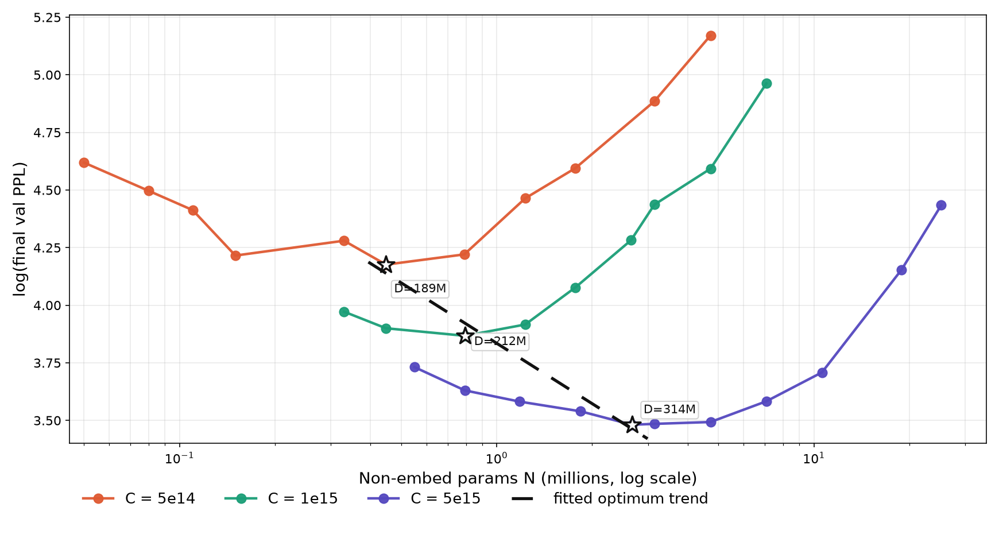

# llm-pipeline

A from-scratch project for training a coding base LLM: tokenizer, dataset pipeline, decoder-only transformer, pre-training loop, generation, and the post-training path toward a coding agent.

This repository is now moving from broad pre-training experiments into post-training. The scaling-law work is preserved as the research foundation; the active next phase is to make the base model more useful for coding tasks.

## 1. Research for Pre-Training

The first phase studied how to spend pre-training compute for a small from-scratch language model. The project replicated a Chinchilla-style scaling-law experiment across several model sizes and token budgets, then used the result to choose a better direction for base-model training.



The main pre-training result: at this small scale, the compute-optimal data-to-parameter ratio was much higher than the classical large-model Chinchilla rule of `D/N ~= 20`, and decreased as compute increased. The extended small-model tail in the `5e14` FLOP sweep helped resolve the left side of the U-curve, showing that below a certain model size, adding more tokens no longer compensates for limited capacity.

| Compute | Optimal N | Optimal D | Optimal D/N |
|---|---:|---:|---:|
| `5e14` FLOPs | about `0.45M` | about `189M` tokens | about `422` |
| `1e15` FLOPs | about `0.79M` | about `212M` tokens | about `267` |
| `5e15` FLOPs | about `2.67M` | about `314M` tokens | about `118` |

Fitting the three corrected optima gives this experiment-specific relationship between model size and training data:

$$
D_{\mathrm{opt}} \approx 2.34 \times 10^8 \left(\frac{N}{10^6}\right)^{0.29}
$$

In plain terms, a `10x` increase in non-embedding model size corresponded to only about `2x` more optimal training tokens in these small-scale runs, while tokens per parameter dropped sharply as the model got larger.

For the detailed experiment record, including the original README, sweep scripts, plots, and notes, see the [`1_scaling_law` branch](https://github.com/chenpy2000/llm-pipeline/tree/1_scaling_law).

## 2. Post-Training

The next phase starts here. The goal is to move from a general pre-trained base model toward a coding-oriented assistant model.

Current training target: train a coding base model that references the Qwen2.5-Coder-0.5B architecture. The active `main_pretrain.py` defaults now use `d_model=896`, `num_layers=24`, `num_heads=14`, `num_key_value_heads=2`, `swiglu_d=4864`, `vocab_size=32768`, `rope_base=1000000`, and `learning_rate=0.0003`.

Post-training work will focus on:

- settling the model architecture before running more training;
- keeping future pre-training runs smaller and more targeted;
- adding supervised fine-tuning data for coding tasks;
- adding evaluation for code generation, editing, and instruction following;
- exploring preference tuning or other alignment steps;
- building toward an agent loop that can read code, modify files, run tests, and improve from feedback.

### New Updates On Post-Training Techniques

Added RoPE inside each attention layer, replacing the previous learned positional embedding table.

Added tied embeddings by sharing the token embedding weights with the output projection weights.

Replaced LayerNorm with RMSNorm throughout the decoder.

Replaced the ReLU feed-forward network with a SwiGLU FFN.

Added grouped-query attention, using 14 query heads and 2 shared key-value heads in each decoder layer.

Added BF16 mixed-precision training on supported CUDA GPUs for faster training.

### Library Replacement

This phase also starts a library-replacement refactor. The goal is not to abandon the from-scratch learning path, but to replace fragile low-level pieces once they become bottlenecks for the coding-agent target.

The reasons are:

1. I want to build a coding agent, and the current 0.5B-scale model lies at the ultimate lower bound for usefulness in that direction.
2. Even that lower-bound pre-training target requires about 7B tokens, which goes beyond what a personal computer can comfortably prepare, store, and feed through the current pipeline.
3. Fragility has already appeared in the data-engineering layer of this PyTorch-grounded low-level project, so tokenizer, dataset, attention, and training infrastructure need framework support before larger runs.

The framework changes will be listed below as they are selected and implemented. For the raw data pre-training reference, see the [`2_pretrain_raw` branch](https://github.com/chenpy2000/llm-pipeline/tree/2_pretrain_raw).

## Active Code

| Path | Purpose |
|---|---|
| `main_pretrain.py` | Main pre-training, evaluation, checkpointing, and sample generation entry point |
| `transformer.py` | Decoder-only transformer model |
| `tokenizer.py` | BPE tokenizer implementation |
| `dataset.py` | Causal language-modeling dataset |
| `tokenizer/` | Saved tokenizer artifacts |
| `chinchilla_curve.png` | Final pre-training scaling-law summary image |
| `archive/` | Archived local scripts, sweep runners, extra plots, and notes from the scaling-law phase |

## Setup

Install from the lockfile:

```bash
uv sync
```

Run the active training pipeline:

```bash
uv run main_pretrain.py
```

Useful overrides:

```bash
uv run main_pretrain.py \
  --d_model 896 \
  --num_layers 24 \
  --num_heads 14 \
  --num_key_value_heads 2 \
  --swiglu_d 4864 \
  --vocab_size 32768 \
  --rope_base 1000000 \
  --learning_rate 0.0003

uv run main_pretrain.py --d_model 128 --num_layers 4 --num_heads 4 --swiglu_d 512
uv run main_pretrain.py --num_docs 500000 --token_budget 20000000 --learning_rate 0.0012
```

Training logs and run configs are written to `output/<timestamp>/`. Resumable pre-training checkpoints are written every 1B consumed tokens to `checkpoints/pretrain/qwen25_coder_05b_<N>b.pt`; a new run automatically resumes from the latest matching checkpoint and continues with `shuffle=False`.
